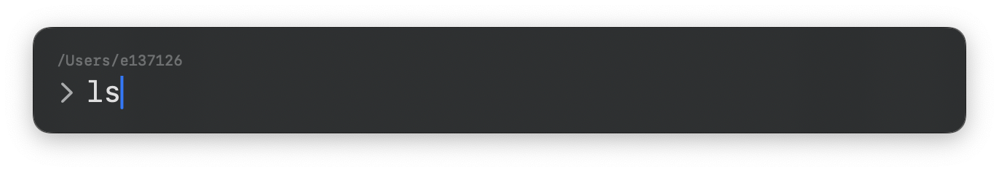

# Capsule

A minimal floating command launcher for macOS. Summon it, run a command, see the result — then get out of the way.

---

## Features

- **Floating panel** - stays above all windows, quick and easy to invoke
- **Always-on-top input bar** — type a command and press Return
- **Live current directory** — shown above the prompt; updates when you `cd`
- **Collapsible output panel** — expands automatically after each command
- **Always in reach** - invoke from menu bar or a shortcut
- **Stop running command** - stop running command with ease

## Requirements

- macOS 15.2 or later

## How it works

Each command runs in a fresh login shell (`$SHELL -l -c`) inside the current directory.
After the command completes, the shell reports its new working directory back to the app so `cd` is tracked across runs.
stdout and stderr are merged into a single output view.
