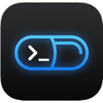

# Capsule

[](https://github.com/rockem/capsule/actions/workflows/test.yml)
[](https://github.com/rockem/capsule/releases)

A minimal floating command launcher for macOS. Summon it, run a command, see the result — then get out of the way.


---

## Features

- **Floating panel** — stays above all windows, quick and easy to invoke
- **Always-on-top input bar** — type a command and press Return
- **Live current directory** — shown above the prompt; updates when you `cd`
- **Collapsible output panel** — expands automatically after each command
- **Always in reach** — invoke from the menu bar or a keyboard shortcut _(shortcut coming soon)_
- **Stop running command** — cancel a long-running command with ease _(coming soon)_

## Requirements

- macOS 15.2 or later

## Installation

1. Download the latest `.dmg` from [Releases](https://github.com/rockem/capsule/releases)
2. Open the `.dmg` and drag **Capsule** to your Applications folder
3. Launch Capsule — if macOS blocks the app, right-click it in Finder and choose **Open**,
   then confirm in the dialog (or go to **System Settings → Privacy & Security** and click **Open Anyway**)
4. A capsule icon appears in the menu bar

> Capsule runs as a menu-bar-only app; no Dock icon is shown.

## Usage

1. Click the Capsule icon in the menu bar and choose **Open Capsule** (or use the keyboard shortcut when available)
2. Type any shell command and press **Return**
3. Output appears inline below the input bar
4. Press **Escape** to hide the panel; your working directory is preserved for the next command

## How it works

Each command runs in a fresh login shell (`$SHELL -l -c`) inside the current directory.
After the command completes, the shell reports its new working directory back to the app so `cd` is tracked across runs.
stdout and stderr are merged into a single output view.

## Development

**Prerequisites:** Xcode 16+, macOS 15.2+

```bash
# Build
xcodebuild -scheme capsule -configuration Debug build CODE_SIGNING_ALLOWED=NO

# Test
xcodebuild -scheme capsule -destination 'platform=macOS' test CODE_SIGNING_ALLOWED=NO

# Lint & format (requires pre-commit)
pre-commit install
pre-commit run --all-files
```

## Contributing

Bug reports and pull requests are welcome — please open an issue first to discuss larger changes.
